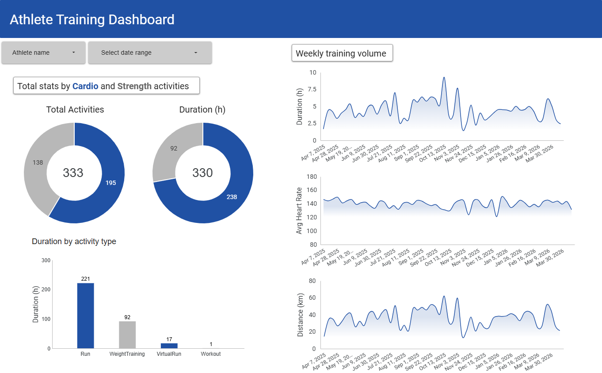

# 🏃 Athlete Training Analytics
### Data Engineering Zoomcamp 2026

---

## 🎯 Problem Description

Athletes and coaches need to understand training patterns, load distribution, and consistency across modalities (Run, Strength, Recovery) to optimize performance and prevent overtraining.

This project uses raw training data from **Intervals.icu** to build a fully automated, cloud-based data pipeline that:

- Ingests raw athlete activity data from the Intervals.icu REST API
- Stores it in a cloud data lake (GCS) as partitioned Parquet files
- Loads and transforms it in BigQuery using a dimensional model (staging → intermediate → marts → reporting)
- Calculates derived metrics including **TRIMP** (Training Impulse, Banister exponential formula)
- Visualizes training behavior in a Looker Studio dashboard

**Business value**: Track weekly training volume and monitor fitness/fatigue trends over time.

---

## 🏗️ Architecture

```
Intervals.icu API
      ↓ (dlt + Kestra)
Google Cloud Storage — raw Parquet files (Bronze)
      ↓ (BigQuery External Table)
BigQuery — partitioned + clustered table (Bronze)
      ↓ (dbt — staging → intermediate → marts → reporting)
BigQuery — dimensional model (Silver + Gold)
      ↓
Looker Studio Dashboard
```

- **Bronze**: Raw API responses stored as Parquet in GCS, loaded into BigQuery as external + partitioned tables.
- **Silver**: Cleaned, typed, and enriched activities (`stg_activities`, `int_activities_enriched`) with TRIMP calculation and unit conversions.
- **Gold**: Dimensional model (`dim_athlete`, `dim_date`, `dim_activity_type`, `fct_activities`) and reporting tables (`rpt_weekly_training`, `rpt_training_by_type`).

---

## ☁️ Cloud & IaC

The project runs entirely on **Google Cloud Platform** and is provisioned with **Terraform**:

- **Google Cloud Storage** bucket for raw data lake
- **BigQuery** dataset for warehouse tables (partitioned + clustered)
- All infrastructure defined as code — no manual GCP console setup required

```bash
cd terraform
terraform init
terraform plan
terraform apply
```

---

## 🛠️ Tech Stack

| Layer | Technology |
|-------|------------|
| Infrastructure as Code | Terraform |
| Ingestion | dlt (data load tool) |
| Orchestration | Kestra |
| Data Lake | Google Cloud Storage (Parquet) |
| Data Warehouse | BigQuery (partitioned by date, clustered by sport) |
| Transformations | dbt Cloud + dbt CLI 1.9 |
| Dashboard | Looker Studio |
| Language | Python 3.13 |
| Containerisation | Docker + Docker Compose |

[](https://www.terraform.io)
[](https://kestra.io)
[](https://cloud.google.com)
[](https://cloud.google.com/bigquery)
[](https://getdbt.com)
[](https://dlthub.com)
[](https://python.org)
[](https://www.docker.com)

---
## ⚡ Quick Commands (Make)

This project includes a `Makefile` for common tasks:

| Command | Description |
|---------|-------------|
| `make help` | Show all available commands |
| `make infra` | Provision GCP infrastructure with Terraform |
| `make start` | Start Kestra locally (UI: http://localhost:8080) |
| `make stop` | Stop Kestra |
| `make pipeline` | Run dlt pipeline locally |
| `make dbt-run` | Run dbt models |
| `make dbt-test` | Run dbt tests |
| `make destroy` | Destroy Terraform infrastructure |

```bash
# Example: provision infra and start Kestra
make infra
make start
```

---

## 📥 Data Ingestion — Batch Pipeline (Kestra + dlt)

The pipeline is fully orchestrated by **Kestra** and runs automatically on the **1st of every month**.

### Pipeline steps (`kestra/05_run_dlt_pipeline.yaml`):

1. **Ingest to GCS** — dlt fetches activities from the Intervals.icu API and writes Parquet files to `gs://athlete-analytics-terra-bucket/raw/`
2. **Create external table** — BigQuery external table pointing to GCS Parquet files
3. **Create non-partitioned table** — materialized from external table
4. **Create partitioned + clustered table** — optimized for downstream queries
5. **Run dbt** — full model run + tests via dbt CLI in Docker

### Kestra flows:
| Flow | Purpose |
|------|---------|
| `01_gcp_kv.yaml` | Set GCP KV store values |
| `03_check_kv_values.yaml` | Create GCS bucket + BQ dataset |
| `05_run_dlt_pipeline.yaml` | Full end-to-end pipeline (scheduled monthly) |

---

## 🗄️ Data Warehouse

BigQuery tables are **partitioned by `start_date_local`** and **clustered by `type`** (activity sport):

```sql
CREATE OR REPLACE TABLE `project.dataset.activities`
PARTITION BY DATE(start_date_local)
CLUSTER BY type
AS SELECT * FROM activities_all_non_partitioned;
```

**Why this makes sense**: Dashboard queries filter by date range (partition pruning) and activity type (cluster pruning), minimising bytes scanned and query cost.

---

## 🔄 Transformations (dbt)

dbt models follow a 4-layer architecture:

```
models/
  staging/          → stg_activities (clean + type-cast source)
  intermediate/     → int_activities_enriched (derived metrics)
  marts/            → dim_athlete, dim_date, dim_activity_type, fct_activities
  marts/reporting/  → rpt_weekly_training, rpt_training_by_type
```

### Custom macros:
- **`calculate_trimp()`** — Banister exponential TRIMP formula: `D(min) × HRr × 0.64 × EXP(1.92 × HRr)`. Reusable Jinja macro that generates SQL at compile time.
- **`get_activity_category()`** — Maps granular activity types to categories (Cardio, Strength, Recovery) using a compile-time Jinja dictionary.
- **`generate_schema_name()`** — Controls dev vs prod schema naming.

---

## 🧪 Data Quality

**36 dbt tests** run automatically after every pipeline execution:

| Test type | Examples |
|-----------|---------|
| `unique` | `activity_id`, `date_id`, `activity_type_id` |
| `not_null` | All key dimension and fact columns |
| `accepted_values` | `activity_category` in (Cardio, Strength, Recovery, Other) |
| Source tests | `_id` unique and not null in raw source |

All 36 tests pass on every run:
```
Done. PASS=36 WARN=0 ERROR=0 SKIP=0 TOTAL=36
```

---

## 📊 Dashboard

**[🔗 View Looker Studio Dashboard](https://datastudio.google.com/reporting/9b59522a-2535-4375-9632-e0f74189d794)**



The dashboard contains:

**Tile 1 — Training time by activity type (categorical)**
Bar chart showing total hours per sport (Run, WeightTraining, VirtualRun, Workout), coloured by category (Cardio vs Strength).

**Tile 2 — Weekly training volume over time (time-series)**
Time series showing weekly training hours broken down by activity category over the full data range.

Additional tiles: total activities scorecard, total distance scorecard, total hours scorecard, average heart rate trend, weekly distance trend.

---

## 🚀 Reproducibility — Quick Start

### Prerequisites
- GCP project with billing enabled
- Intervals.icu account + API key
- Docker + Docker Compose
- Terraform
- Python 3.11+

### 1. Clone the repo
```bash
git clone https://github.com/PanosChatzi/athlete-training-analytics.git
cd athlete-training-analytics
```

### 2. GCP credentials
```bash
mkdir -p ~/.gcp
cp your-service-account.json ~/.gcp/workflow-orchestration-credentials.json
```

### 3. Provision infrastructure
```bash
cd terraform
terraform init
terraform apply
cd ..
```

### 4. Configure secrets
Create `keys/.env_encoded` with base64-encoded secrets:
```bash
echo "SECRET_GCP_SERVICE_ACCOUNT=$(cat ~/.gcp/workflow-orchestration-credentials.json | base64 -w 0)" >> keys/.env_encoded
echo "SECRET_ICU_ATHLETE_ID_1=$(echo -n 'your_athlete_id' | base64 -w 0)" >> keys/.env_encoded
echo "SECRET_ICU_API_KEY_1=$(echo -n 'your_api_key' | base64 -w 0)" >> keys/.env_encoded
```

### 5. Start Kestra
```bash
docker-compose up -d
# Kestra UI: http://localhost:8080
```

### 6. Upload and run Kestra flows
1. Go to `http://localhost:8080`
2. Upload all flows from `kestra/` folder
3. Run `01_gcp_kv` → `02_gcp_setup` → `05_run_dlt_pipeline`

### 7. dbt transformations
dbt runs automatically as part of `05_run_dlt_pipeline`. To run manually:
```bash
# dbt Cloud IDE or CLI
dbt deps
dbt run
dbt test
```

### 8. View dashboard
Connect data to Looker Studio and build the dashboard.

---

## 📁 Project Structure

```
athlete-training-analytics/
├── terraform/              # GCP infrastructure (GCS + BigQuery)
├── kestra/                 # Orchestration flows
│   ├── 01_gcp_kv.yaml
│   ├── 02_gcp_setup.yaml
│   └── 05_run_dlt_pipeline.yaml
├── models/                 # dbt models
│   ├── staging/
│   ├── intermediate/
│   ├── marts/
│   └── marts/reporting/
├── macros/                 # dbt Jinja macros
│   ├── calculate_trimp.sql
│   ├── get_activity_category.sql
│   └── generate_schema_name.sql
├── main.py                 # dlt pipeline entry point
├── docker-compose.yml      # Kestra + Postgres
└── dbt_project.yml
```

---

## 🙏 Acknowledgments

Built for the **[Data Engineering Zoomcamp 2026](https://github.com/DataTalksClub/data-engineering-zoomcamp)** by DataTalks.Club.

Data source: [Intervals.icu](https://intervals.icu) — athlete training platform.